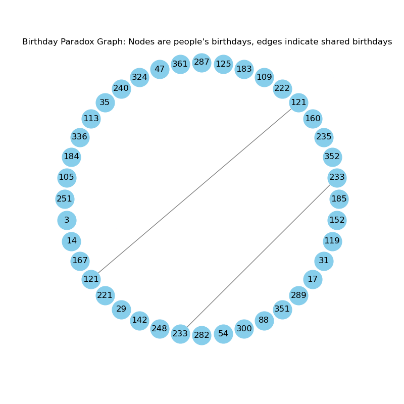

# Birthday Paradox and other Combinatorial and Probability Problems



This repository contains a Jupyter Notebook that explores and visualizes the Birthday Paradox and other Combinatorial Problems. The Birthday Paradox is a famous problem in probability theory that demonstrates how our intuition about probabilities can be misleading. It states that in a group of just 23 people, there is a better than even chance that at least two people share the same birthday.

## Contents

- `Birthday Paradox.ipynb`: The main Jupyter Notebook that includes the explanation, mathematical calculations, and visualizations related to the Birthday Paradox.

## Requirements

To run the code in this repository, you will need the following Python libraries:

- `numpy`
- `matplotlib`
- `networkx`
- `random`

You can install the required libraries using the following command:

```bash
pip install numpy matplotlib networkx
```

## Usage

1. Clone the repository:

```bash
git clone https://github.com/galenwilkerson/Birthday-Paradox.git
```

2. Navigate to the repository directory:

```bash
cd Birthday-Paradox
```

3. Open the Jupyter Notebook:

```bash
jupyter notebook "Birthday Paradox.ipynb"
```

4. Run the cells in the notebook to explore the Birthday Paradox, perform probability calculations, and visualize the results.

## Visualization

The notebook includes a function to visualize the Birthday Paradox using a graph where nodes represent people and edges indicate shared birthdays. The graph uses a circular layout to display connections effectively.

## License

This project is licensed under the MIT License - see the [LICENSE](LICENSE) file for details.

## Acknowledgments

- This project was inspired by the famous Birthday Paradox problem in probability theory.
- Thanks to the contributors and the open-source community for their invaluable support.
